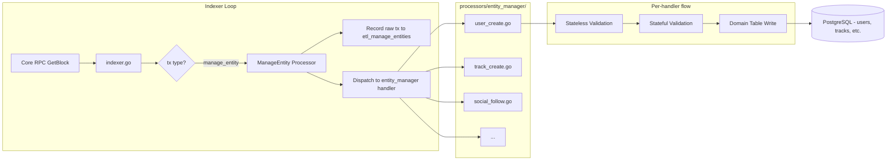

# ETL Entity Manager Parity Plan

## Current State

The ETL package (`[pkg/etl/](pkg/etl/)`) indexes OpenAudio blockchain data into PostgreSQL. The existing `ManageEntity` processor (`[pkg/etl/processors/manage_entity.go](pkg/etl/processors/manage_entity.go)`) is **append-only** -- it records raw manage_entity transactions into `etl_manage_entities` without any validation or domain table writes.

The discovery-provider entity manager (`apps/packages/discovery-provider/src/tasks/entity_manager/`) does full semantic processing: stateless validation (format checks), stateful validation (existence/ownership/uniqueness), and domain table writes (users, tracks, playlists, follows, saves, reposts, etc.).

## Target State

The ETL `ManageEntity` processor dispatches to per-entity-action handlers in `processors/entity_manager/` that mirror the discovery-provider's validation and domain table writes. When deployed against the same PostgreSQL database, the ETL indexer replaces the discovery-provider celery indexer.

## Architecture



## Entity/Action Scope (from discovery-provider)

**Core entities:** User (Create, Update, Verify), Track (Create, Update, Delete, Download), Playlist (Create, Update, Delete)

**Social features:** Follow/Unfollow, Save/Unsave, Repost/Unrepost, Share, Subscribe/Unsubscribe

**Other entities:** DeveloperApp (Create, Update, Delete), Grant (Create, Delete, Approve, Reject), Comment (Create, Update, Delete, React, Unreact, Pin, Unpin, Report, Mute, Unmute), DashboardWalletUser (Create, Delete), AssociatedWallet (Create, Delete), Notification (Create, View, ViewPlaylist), Tip (Update), MutedUser (Mute, Unmute), EncryptedEmail (AddEmail), EmailAccess (Update), Event (Create, Update, Delete)

## Graphite Setup

`gt` is already installed at `/opt/homebrew/bin/gt`. We will initialize the repo with graphite and use stacked PRs. Each PR builds on the previous one:

```
main
  └── rj/etl-em-foundation      (PR 1: setup)
       └── rj/etl-em-user-create  (PR 2: first entity)
            └── rj/etl-em-user-update (PR 3)
                 └── ...
```

## PR Breakdown

### PR 1: Foundation (`rj/etl-em-foundation`)

This PR sets up the scaffolding. No entity processing yet.

**1a. Directory structure:**

```
pkg/etl/processors/entity_manager/
├── handler.go           # Handler interface, dispatcher, ManageEntityParams, Action/EntityType constants
├── handler_test.go      # Dispatcher tests
├── testutil_test.go     # Test helpers: seed data, mock tx builder, test DB setup
└── validate.go          # Shared validators: validate_signer, common error types
```

**1b. Core types in `handler.go`:**

- `EntityType` and `Action` string constants mirroring the discovery-provider enums (from `[utils.py` lines 70-137](apps/packages/discovery-provider/src/tasks/entity_manager/utils.py))
- `Handler` interface:

```go
type Handler interface {
    EntityType() string
    Action() string
    Handle(ctx context.Context, params *Params) error
}
```

- `Params` struct (Go equivalent of `ManageEntityParameters`):

```go
type Params struct {
    TX          *corev1.ManageEntityLegacy
    UserID      int64
    EntityID    int64
    EntityType  string
    Action      string
    Signer      string
    Metadata    map[string]any  // parsed JSON metadata
    BlockNumber int64
    BlockTime   time.Time
    TxHash      string
    DB          *db.Queries     // for stateful validation + writes
}
```

- `Dispatcher` that routes `(entity_type, action)` pairs to registered handlers
- `ValidationError` type -- returned when validation fails (tx is skipped, not fatal)

**1c. Shared validation in `validate.go`:**

- `ValidateSigner(params)` -- checks signer matches user wallet or has valid grant (mirrors `[utils.py` validate_signer](apps/packages/discovery-provider/src/tasks/entity_manager/utils.py))
- Error helper functions

**1d. Test infrastructure in `testutil_test.go`:**

- `setupTestDB(t)` -- spins up a test PostgreSQL (via testcontainers or connects to a test DB), runs migrations, returns `*db.Queries`
- `seedUser(t, q, userID, wallet, handle)` -- inserts a user row for stateful tests
- `seedTrack(t, q, trackID, ownerID)` -- inserts a track row
- `buildManageEntityTx(entityType, action, userID, entityID, signer, metadata)` -- creates a `*corev1.SignedTransaction` with `ManageEntityLegacy`
- `mustHandle(t, handler, params)` and `mustReject(t, handler, params, wantErr)` -- assertion helpers

**1e. Wire dispatcher into existing `ManageEntity` processor:**

Update `[processors/manage_entity.go](pkg/etl/processors/manage_entity.go)` to call the dispatcher after the existing raw insert. Validation failures are logged and skipped (non-fatal).

**1f. DB migration for core domain tables:**

New migration `0002_entity_manager_tables.up.sql` in `pkg/etl/db/sql/migrations/` (alongside the existing `0001_etl_tables.up.sql`).

The existing migration system handles this perfectly:

- `[db/migrate.go](pkg/etl/db/migrate.go)` uses `//go:embed sql/migrations/` with `golang-migrate`
- `golang-migrate` tracks applied migrations in the `etl_db_migrations` table -- inherently idempotent
- `Indexer.Run()` calls `db.RunMigrations()` automatically before indexing starts
- Any consumer that imports the ETL package and calls `Run()` gets migrations for free

Tables to create (matching discovery-provider schema exactly):

- `users` (matching discovery-provider's `users` table schema)
- `tracks` (matching `tracks` table)
- `playlists` (matching `playlists` table)
- `follows`, `saves`, `reposts` (social tables)
- `track_routes`, `playlist_routes`
- `developer_apps`, `grants`
- Required enums (`savetype`, `reposttype`)

This migration creates ALL tables up front so subsequent PRs just add handlers.

**1g. Local runner script (`examples/etl/main.go`):**

A standalone Go program that exercises the ETL package against a real RPC and local database. This is the primary manual testing tool alongside unit tests.

```go
// Usage:
//   go run ./examples/etl \
//     --rpc https://core.audius.co \
//     --db "postgres://localhost:5432/etl_local?sslmode=disable"
```

How it works:

- Parses `--rpc` and `--db` flags (with env var fallbacks `ETL_RPC_URL`, `ETL_DB_URL`)
- Creates a `CoreServiceClient` via ConnectRPC (same pattern as `[examples/indexer/main.go](examples/indexer/main.go)`)
- Creates an `etl.Indexer`, calls `SetDBURL()` and `Run()`
- Migrations run automatically inside `Run()` -- creates all tables (both `0001` ETL tables and `0002` entity manager tables)
- Uses a zap development logger at Debug level

For the transaction visibility ("see each tx payload + completion"), we add two structured debug log lines in `indexer.go`:

1. **Before processing**: `logger.Debug("processing tx", zap.String("type", txType), zap.String("hash", hash), zap.Any("payload", tx))` -- logs the raw transaction payload
2. **After processing**: `logger.Debug("tx indexed", zap.String("type", txType), zap.String("hash", hash), zap.Duration("elapsed", dur))` -- logs successful write

These log lines exist in the indexer itself (not just the runner), so any consumer with a Debug-level logger gets visibility. The runner script simply configures the logger at Debug level with pretty-printed console output.

Example output when running:

```
DEBUG  processing tx  {"type": "manage_entity", "hash": "abc123...", "payload": {"user_id": 12345, "entity_type": "User", "action": "Create", ...}}
DEBUG  tx indexed      {"type": "manage_entity", "hash": "abc123...", "elapsed": "2.3ms"}
DEBUG  processing tx  {"type": "play", "hash": "def456...", "payload": {"plays": [...]}}
DEBUG  tx indexed      {"type": "play", "hash": "def456...", "elapsed": "1.1ms"}
```

The runner also disables optional components that add noise during local testing:

```go
indexer.SetConfig(etl.Config{
    EnableMaterializedViewRefresh: false,
    EnablePgNotifyListener:        false,
})
```

**1h. Update FEATURE.md** with the entity_manager architecture, handler pattern, local runner instructions, test instructions, and PR roadmap.

### PR 2: User Create (`rj/etl-em-user-create`)

Files:

- `processors/entity_manager/user_create.go`
- `processors/entity_manager/user_create_test.go`

Stateless validation:

- `entity_type == "User"`, `action == "Create"`
- `user_id >= USER_ID_OFFSET`
- Handle format (alphanumeric + underscore/dot, max 30 chars, not reserved)
- Name length (max 32 chars)
- Bio length (max character limit)

Stateful validation:

- User does not already exist (`SELECT ... FROM users WHERE user_id = $1 AND is_current = true`)
- Signer is not a developer app

Domain write:

- Insert new `users` row with `is_current = true`

Tests:

- Valid user creation
- Reject: user already exists
- Reject: handle too long, invalid characters, reserved word
- Reject: user_id below offset

### PR 3-N: Remaining Entity/Action Pairs

Each PR adds exactly one `<entity>_<action>.go` + `<entity>_<action>_test.go` file. Suggested ordering (dependencies build naturally):

| PR  | Branch                      | Entity/Action                                         | Key Validations                                                         |
| --- | --------------------------- | ----------------------------------------------------- | ----------------------------------------------------------------------- |
| 3   | `rj/etl-em-user-update`     | User Update                                           | validate_signer, bio length, handle uniqueness                          |
| 4   | `rj/etl-em-user-verify`     | User Verify                                           | verifier address check                                                  |
| 5   | `rj/etl-em-track-create`    | Track Create                                          | track_id offset, owner_id required, genre allowlist, description length |
| 6   | `rj/etl-em-track-update`    | Track Update                                          | validate_signer, ownership, existence                                   |
| 7   | `rj/etl-em-track-delete`    | Track Delete                                          | ownership, existence, soft delete                                       |
| 8   | `rj/etl-em-playlist-create` | Playlist Create                                       | playlist_id offset, metadata validation                                 |
| 9   | `rj/etl-em-playlist-update` | Playlist Update                                       | ownership, existence                                                    |
| 10  | `rj/etl-em-playlist-delete` | Playlist Delete                                       | ownership, soft delete                                                  |
| 11  | `rj/etl-em-social-follow`   | Follow/Unfollow                                       | signer, target exists, no self-follow, no duplicate                     |
| 12  | `rj/etl-em-social-save`     | Save/Unsave                                           | signer, target exists, no self-save, no duplicate                       |
| 13  | `rj/etl-em-social-repost`   | Repost/Unrepost                                       | signer, target exists, no self-repost, no duplicate                     |
| 14+ | ...                         | Developer apps, grants, comments, notifications, etc. | Per-entity rules                                                        |

### What to Defer

- **Side effects** (challenge bus, notifications, trending updates) -- not needed for indexing parity
- **Content access checks** (remixability, gated content) -- add after core entities work
- **Non-entity-manager celery tasks** (per user's instruction)

## Testing Strategy

Two complementary approaches, each serving a different purpose:

### 1. Unit/integration tests (`_test.go` files) -- automated, CI-friendly

Each handler has a `_test.go` with table-driven tests. The test infrastructure in `testutil_test.go` provides:

- `**setupTestDB(t)`*: Connects to a test Postgres (testcontainers or `ETL_TEST_DB_URL` env var), runs all migrations, returns `*db.Queries`. Each test gets a clean schema via `RunMigrations(downFirst: true)`.
- **Seeders** (`seedUser`, `seedTrack`, etc.): Insert prerequisite rows so stateful validation can be tested in isolation.
- `**buildManageEntityTx()`*: Constructs a `*corev1.SignedTransaction`wrapping`ManageEntityLegacy` with the given entity_type, action, user_id, entity_id, signer, and metadata JSON.
- `**buildParams()`*: Combines a tx, test DB, and block context into a `*Params` ready to pass to a handler.
- **Assertions**: `mustHandle(t, handler, params)` expects success; `mustReject(t, handler, params, "expected error substring")` expects a `ValidationError`.

A typical test reads like a specification:

```go
func TestUserCreate_RejectsExistingUser(t *testing.T) {
    q := setupTestDB(t)
    seedUser(t, q, 100001, "0xabc...", "alice")
    params := buildParams(t, q, "User", "Create", 100001, 100001, "0xabc...", `{"handle":"alice"}`)
    mustReject(t, UserCreate(), params, "already exists")
}
```

Run: `cd pkg/etl && go test ./processors/entity_manager/... -v`

### 2. Local runner (`examples/etl/`) -- manual, against live data

For end-to-end testing against production or staging chains. You run it, point it at an RPC and local Postgres, and watch real transactions flow through the full pipeline. Useful for:

- Verifying the indexer handles real-world transaction shapes
- Spotting edge cases in metadata parsing
- Testing migration idempotency on a fresh database
- Smoke-testing before deploying a new handler

Run: `go run ./examples/etl --rpc https://core.audius.co --db "postgres://localhost:5432/etl_local?sslmode=disable"`

## Key Design Decisions

- **WET over DRY**: Each handler file is self-contained and readable. Shared validation lives in `validate.go` but entity-specific checks are inline in the handler.
- **Test ergonomics**: Every handler has a corresponding `_test.go` with table-driven tests. `testutil_test.go` provides seeders and assertion helpers so tests read like specifications.
- **DB schema matches discovery-provider exactly**: Same table names, column names, types, and composite primary keys. This enables the cutover strategy (stop celery, start ETL, same DB).
- **Validation errors are non-fatal**: A `ValidationError` means "skip this tx" not "stop indexing." Mirrors discovery-provider's `IndexingValidationError` catch pattern.
- **Graphite stacking**: Each PR is small, focused, and reviewable. The stack builds naturally -- foundation first, then one entity_action at a time.
